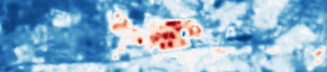

# Urban Heat Island Detector

### Final project for the Data Science Bootcamp at SPICED Academy, April-June 2023. _By Jan Kühn_

The **Urban Heat Island (UHI) effect** is a significant environmental issue that refers to the increased temperature in urban areas compared to their rural surroundings. This phenomenon is primarily caused by human activities, changes in land use, and built infrastructure. Dark surfaces, such as certain roofing materials, are known to absorb more solar radiation and contribute to elevated temperatures.

The UHI effect **exacerbates the impacts of climate change**, leading to **increased energy consumption**, **impaired air quality**, and **adverse health effects** such as heat-related illnesses and mortality.

As **heat waves** are likely to become more frequent, preventing and mitigating the UHI effect is crucial for sustainable urban development and **climate change adaptation**.

### Goal of the project

The goal of the project was to use satellite imagery – including infrared bands – to **detect and visualize UHI effects** in urban areas.

To accomplish that, the plan was to build and train a **Deep Learning model to segment building roofs** in urban areas from high-resolution satellite imagery.

With that data, we could **identify spots for public interventions** like green roofs, change of roof material/color, or installation of solar panels.

### What I did

- I used **pre-trained Unet segmentation model** with transfer learning to recognize building footprint on satellite imagery.
  - The model is based on a **resnet-34 / resnet-50 backbone** (both are included) and imagenet weights.
  - It is a **Convolutional Neural Network (CNN)** with 34 / 50 Layers.
    • Being a **Unet model** means that it has an encoding part and a decoding part (to reconstruct the image).
- The **dataset** I used for training is called **Landcover.ai**.
  - It is **publicly available** on [kaggle.com](https://www.kaggle.com/datasets/adrianboguszewski/landcoverai?resource=download) and consists of **40 high resolution labeled images**.
  - I broke those images down to about **40.000 patches of 256x256px** size.
  - From those, I **selected 2.000 patches with relevant information** for training (because most is woodland, which is not of use in this case).
  - The **metric** I used was **Mean IoU (Intersection over Union)**. It is a number from 0-1 which specifies **amount of overlap between prediction & ground truth**. 0 means _no overlap_, 1 means _complete overlap_ (100%).
  - The **best score** I reached on unseen test data: 0.86.
- Additionally, I wrote Python scripts to process **Landsat 8 satellite imagery**.

### Use

You can see results of the project in a **Streamlit App** which basically contains the live presentation of the final project. In the section "Segment" (Live Segmentation) you can try the segmentation from satellite imagery.

To run the Streamlit App, set up a Python environment, clone the repository and install the required packages, for example using PIP.

**Important:** Before running streamlit run app.py, make sure to add `SM_FRAMEWORK` as an environment variable:

```
git clone https://github.com/yotkadata/uhi_detector
cd uhi_detector/
pip install -r requirements.txt

export SM_FRAMEWORK=tf.keras
streamlit run app.py
```
